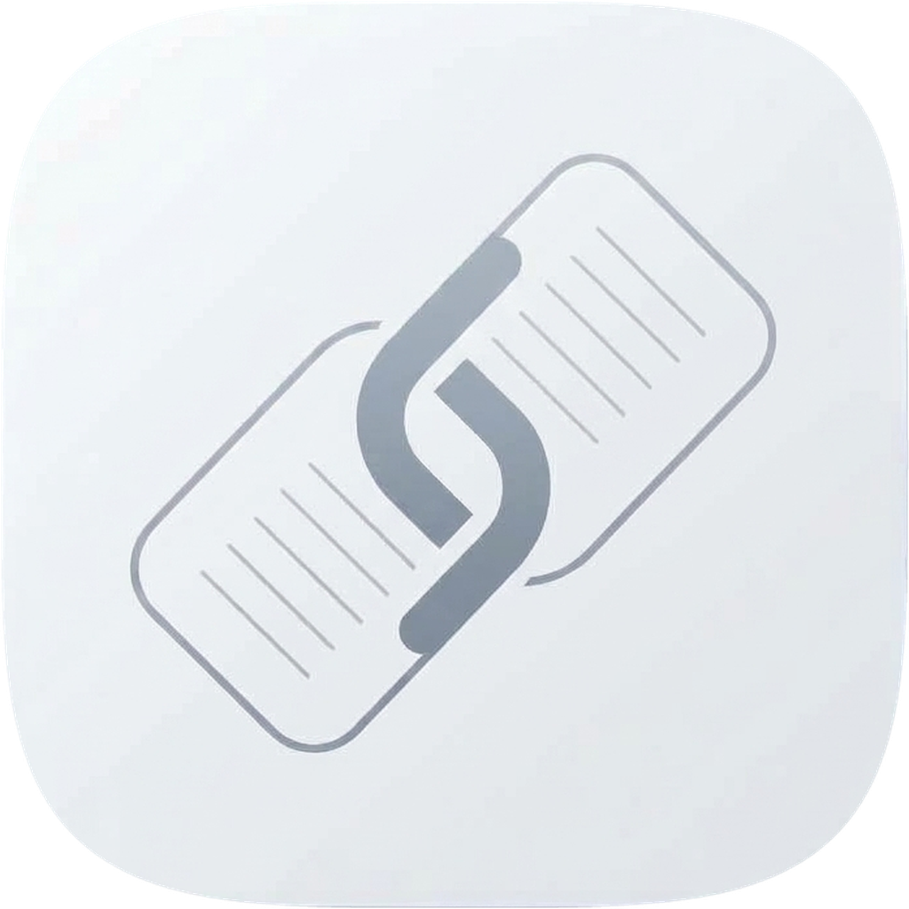
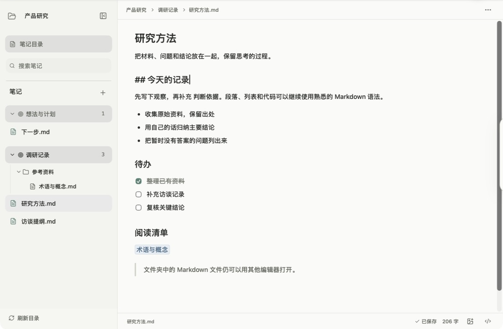
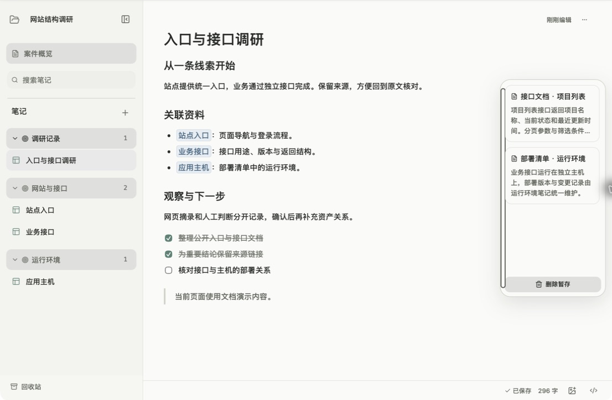
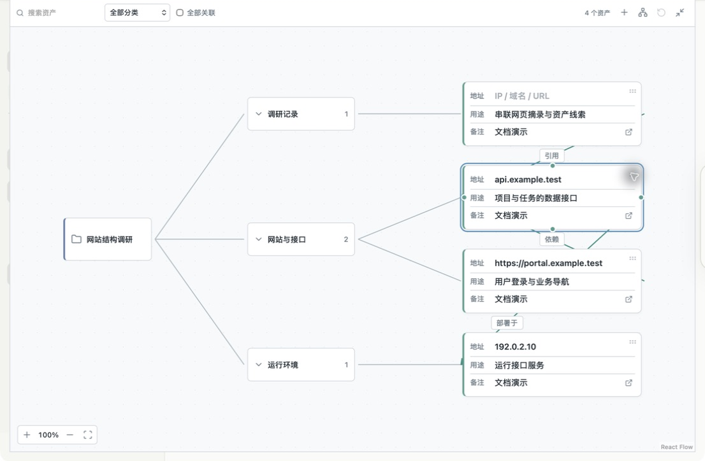

<p align="center"></p>

# Notechain · 链迹笔记

本地 Markdown 笔记工具，把笔记、网页摘录和资产线索关联起来。

[下载 Mac / Windows 版与浏览器扩展](https://github.com/Lyi-Fan/Notechain/releases) · [AI skill](skills/notechain-graph/SKILL.md)

## 从文件夹开始

顶栏可以随时切换两种模式，编辑方式相同：

| 模式 | 适合做什么 | 内容如何组织 |
| --- | --- | --- |
| 笔记 | 写作、学习、整理本地 Markdown | 笔记本 → 分类 / 嵌套文件夹 → 文件 |
| 资产收集 | 调研站点、追踪来源和资产关系 | 案件 → 资产分类 → 资产笔记 |

在**笔记本首页**打开文件夹，会把它作为笔记本；进入笔记本后打开文件夹，则作为分类登记。更深的目录按原结构展开。文件直接保存为 Markdown，也能用其他编辑器打开。



以下截图来自 Mac 客户端，内容均为虚构示例；示例资料库不随安装包分发。

## 只编辑正在看的那一处

照常输入 Markdown。点击已渲染的标题、加粗文字或列表项，可在原位置修改这部分源码，其余内容继续保持渲染。按 `Esc` 完成并退出就地编辑；底部 `</>` 按钮可切换整篇源码。

选中文字会出现浮动工具栏，可加粗、设为待办或建立关联。正文**自动保存**，返回笔记时会恢复阅读位置；图片支持粘贴、拖入和底部图片按钮，导出菜单支持 Markdown / PDF。

代码块左上的三个圆点分别用于**折叠、切换行号、复制代码**，右侧可直接修改代码语言。

## 关联起来，不必来回翻找

输入 **`[[`**，搜索后回车插入关联；也可以选中文字后点击工具栏的关联按钮。笔记模式列出已加载目录中的 Markdown 文件，资产模式搜索已有资产笔记。

- 资产笔记中的关联支持**悬停预览**；按**空格**展开，内部笔记还可以直接编辑。
- **单击**链接，修改当前显示的文字；**双击**才跳转。
- 悬停链接并**按住 `Tab`**，临时切换目标与标注；此时点击，可编辑另一项。
- 资产模式下，选中文字可以“记为发现”或“收起为敏感发现”；敏感发现以掩码显示，点眼睛临时查看。



## 收集后，点一下放进笔记

从 Release 下载扩展并解压，在 Chrome / Edge 扩展管理页选择“加载已解压的扩展程序”。打开 Notechain，点击顶栏**地球图标**开启配对，再在扩展里完成连接。

1. 网页中选中文字，用扩展送入**中转站**；笔记内的选区也可以拖入暂存。
2. 回到目标笔记，**点击正文确定插入位置**。
3. 打开中转站，**点击条目**添加。内容保留来源与摘录信息，保存成功后从中转站移除。

来源不必丢失，插入也不必反复拖拽。Mac 可另接兼容修改版 Atoll；此仓库不包含 Atoll 应用。

## 让笔记长成资产关系图

资产模式的**概览**会按分类排列资产，并从笔记里的地址、引用和已有关系生成架构图。



- **右键空白处**新建资产块，点击地址、用途、备注直接编辑。手动新建的块由你拉线关联。
- 从块边缘的**小圆点拖到另一个块**，建立有方向的连接；拖动块可调整位置。
- **拖动空白处平移，滚轮缩放**；“重新排列为横向树”整理布局。
- 点击块右下角跳回笔记。右键“从图中移除”只移除图上的项目，原笔记仍保留。

## 几个容易错过的操作

| 场景 | 操作 |
| --- | --- |
| 建立笔记 / 资产关联 | 输入 `[[`，搜索后按 `Enter` |
| 展开资产关联预览 | 鼠标停在关联或预览上，按 `Space` |
| 查看链接另一项 | 悬停链接，按住 `Tab`；松开恢复 |
| 切换行内代码 | 选中同一段内至少 3 个字符，按 `Tab` |
| 代码块缩进 | 代码块中按 `Tab`，每次 2 个空格 |
| 结束就地 Markdown 编辑 | `Esc`；行内格式也可按 `Enter` |
| 编辑链接时 | `Enter` 确认，`Esc` 取消 |
| 调整资产图 | 空白处拖动平移，滚轮缩放 |

## 让 AI 批量整理

软件运行时，AI 可使用 `ledger` CLI 和 [notechain-graph skill](skills/notechain-graph/SKILL.md) 读取资产图、生成布局、批量修改节点与关系，不需要额外编写接入脚本。

```powershell
$ledger = Join-Path $env:LOCALAPPDATA 'Notechain\ledger.exe'
& $ledger graph cases
& $ledger graph get CASE_ID --output graph.json
& $ledger graph apply CASE_ID --file patch.json --preview
```

Mac 路径：`/Applications/Notechain.app/Contents/MacOS/ledger`。`--preview` 先预览，去掉后才保存；PowerShell 优先用 `--file`，支持 UTF-8 和带 BOM 的 UTF-16。当前 CLI 面向资产架构图。

<details>
<summary>安装要求、开发与数据位置</summary>

Mac 支持 Apple Silicon，最低 macOS 14；Windows 提供 x64 安装包，使用 WebView2。当前 Beta 没有正式代码签名，Mac 版尚未公证。

技术栈：Tauri 2、Rust、React、TypeScript。开发需要 Node.js 24 LTS 与 Rust stable；Mac 需要 Xcode 命令行工具，Windows 需要 C++ Build Tools、Windows SDK 和 WebView2。

```text
npm ci
npm run mac:dev
npm run mac:build
```

Windows 使用 `npm.cmd run windows:dev` / `npm.cmd run windows:build`。

```text
npm run test:unit
npm run test:extension
npm run test:native
cargo build --locked --manifest-path src-tauri/Cargo.toml --bin ledger
npm run test:cli
npm run release:audit
```

应用资料库：Mac 为 `~/Library/Application Support/io.github.lyi-fan.notechain`；Windows 为 `%APPDATA%\io.github.lyi-fan.notechain`。笔记本索引位于资料库的 `.fan`，Markdown 文件留在用户选择的目录。新安装为空白资料库，不会自动扫描或迁移旧数据。

`ASSET_LEDGER_DEV_DATA` 可指定隔离的开发资料库。测试输入在运行时生成，`.qa` 中的笔记、数据库和结果不会提交。README 截图仅包含专门准备的虚构演示内容。

第三方许可见 `src-tauri/licenses`、`public/THIRD_PARTY_NOTICES.txt` 和扩展字体、图标目录。

</details>
