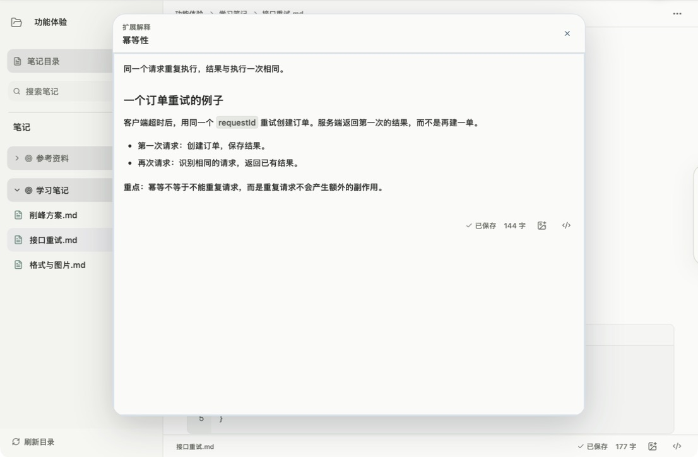

<p align="center"></p>

# Notechain · 链迹笔记

本地 Markdown 笔记工具。把需要补充的解释收起来，把来自其他地方的资料关联起来。

[下载](https://github.com/Lyi-Fan/Notechain/releases) · [AI skill](skills/notechain-graph/SKILL.md)

## 读到陌生名词，解释不必挤进正文

写接口设计时，记下这样一句话：

> 重试请求应满足 **幂等性**，避免重复创建订单。

查清原理后，选中“幂等性”，右键 → **添加扩展解释**，在展开的区域写：

> 同一个请求重复执行，结果与执行一次相同。
>
> 例如：客户端超时后，用同一个 `requestId` 重试创建订单。服务端返回第一次的结果，而不是再建一单。

正文仍是一句短话。需要回忆时，悬停看摘要，点击或按空格展开解释，直接修改内容；`Esc` 收起。解释保存在**当前笔记内**，不会多建一篇文章。右键移除解释时，原来的词仍保留。



## 有一篇现成的笔记，就保留它的来源

“消息队列原理.md”里已有一段：

> 消息队列让请求先进入队列，由消费者异步处理。生产者与消费者可以分别扩展。

现在要在“削峰方案.md”里引用它：

1. 在来源笔记选中这段话，右键 → **加入中转站**，也可以把选区拖进去。
2. 打开目标笔记，点击正文确定插入位置。
3. 打开中转站，点击这条资料，插入带来源的关联块。

悬停关联块可预览原文，按空格展开后还能编辑来源笔记。关联块再次经过中转站时，仍指向最初的来源。保存成功才移除暂存；保存失败时保留条目，重试不会再插入一份。

**扩展解释**补充当前这句话；**中转站关联**引用另一篇真实笔记。两者使用相同的预览和展开交互。


## 网页里的资料，也可以这样收集

查阅接口文档时，选中“同一幂等键的重复请求返回首次执行结果”，用浏览器扩展送入中转站；回到“接口重试.md”，选好位置后点击插入。以后预览这条摘录时，还能回到原网页核对上下文。

扩展从 Release 下载并解压，在 Chrome / Edge 中选择“加载已解压的扩展程序”。软件顶栏的**地球图标**开启配对，扩展中完成连接。Mac 可另接兼容修改版 Atoll，本仓库不包含 Atoll 应用。

## 原来的 Markdown 和图片，一起打开

已有 Obsidian / Typora 笔记时，把 `.md` 与图片目录一起放进笔记本，打开最外层文件夹。例如以下图片写法都可读取：

```markdown
![[Pasted image 20260922114737.png]]
![[assets/流程图.png|320]]


```

支持 PNG、JPEG、GIF、WebP；同名图片不唯一时，写出所在目录。只放附件的常见图片目录不会占据笔记分类位置，图片文件不会被删除。粘贴新图片时，程序保存附件并写入相对路径。

顶栏的**笔记模式**用于本地文件，**资产收集模式**用于案件、资产与关系图。笔记本首页打开文件夹就是打开笔记本；笔记本内打开文件夹则登记为分类，更深的目录照原结构展开。


## 熟悉的语法，继续直接写

这段接口笔记可以直接输入或粘贴：

```markdown
## 重试策略

- **必须**复用相同的 `requestId`
- [x] 保留第一次执行结果
- [ ] 验证并发重试
```

标题、加粗、斜体、删除线、行内代码、代码块、列表、待办、引用和表格会按 Markdown 渲染。点击某一处格式，只展开那一处源码；`Esc` 完成编辑。底部 `</>` 可切换整篇源码。

较长的接口响应可以放进代码块：红点折叠，黄点切换行号，绿点复制，右侧修改语言。正文自动保存，返回笔记时恢复阅读位置。

## 资产越记越多时，看看它们的关系

一次站点调研记录了入口 `portal.example.test`、接口 `api.example.test` 和主机 `192.0.2.10`。切换到案件**概览**，即可按分类查看这些资产及已有的引用关系。

已确认的部署关系可以手动连线、填写依据；不会仅因两个地址同时出现，就断言它们存在部署关系。


右键空白处新建资产块，点击地址、用途、备注直接编辑；从块边缘的小圆点拖出连线。拖动空白处平移，滚轮缩放，右下角按钮跳回笔记。“从图中移除”只影响视图，原笔记仍保留。

## 常用操作速查

| 想做什么 | 操作 |
| --- | --- |
| 解释一个词 | 选中文字 → 右键“添加扩展解释” |
| 引用其他资料 | 在来源处加入中转站 → 目标笔记选位置 → 点击条目 |
| 展开预览 | 悬停关联 / 解释，按 `Space`；解释也可直接点击 |
| 收起预览 | `Esc` |
| 修改真实关联的文字 / 打开来源 | 单击编辑，双击跳转 |
| 查看真实关联的目标与标注 | 悬停并按住 `Tab`，松开恢复 |
| 切换行内代码 | 选中同一段内至少 3 个字符，按 `Tab` |
| 结束就地 Markdown 编辑 | `Esc`；行内格式也可按 `Enter` |

## 交给 AI 批量整理

已经收集好一批资产时，可以让 AI 读取当前结构，补充用途和有依据的关系，再预览修改。程序运行时使用 `ledger` CLI 与 [notechain-graph skill](skills/notechain-graph/SKILL.md)，无需另写接入脚本。

```powershell
$ledger = Join-Path $env:LOCALAPPDATA 'Notechain\ledger.exe'
& $ledger graph cases
& $ledger graph get CASE_ID --output graph.json
& $ledger graph apply CASE_ID --file patch.json --preview
```

Mac 路径为 `/Applications/Notechain.app/Contents/MacOS/ledger`。`--preview` 不保存修改；当前 CLI 面向资产架构图。

<details>
<summary>安装要求、开发与数据位置</summary>

Mac 支持 Apple Silicon，最低 macOS 14；Windows 提供 x64 安装包，使用 WebView2。当前 Beta 没有正式代码签名，Mac 版尚未公证。

技术栈为 Tauri 2、Rust、React、TypeScript。开发需要 Node.js 24 LTS、Rust stable，以及对应平台的原生构建工具。

```text
npm ci
npm run mac:dev
npm run mac:build
npm run test:unit
npm run test:native
```

Windows 使用 `npm.cmd run windows:dev` / `npm.cmd run windows:build`。CLI 输入支持 UTF-8 和带 BOM 的 UTF-16，PowerShell 建议使用 `--file`。

应用资料库：Mac 为 `~/Library/Application Support/io.github.lyi-fan.notechain`；Windows 为 `%APPDATA%\io.github.lyi-fan.notechain`。笔记本索引位于资料库的 `.fan`，Markdown 文件留在用户选择的目录。新安装不会自动扫描或迁移旧数据。

README 截图均为虚构示例。演示笔记、数据库、测试结果和本机路径不提交；第三方许可保留在各自目录。

</details>
